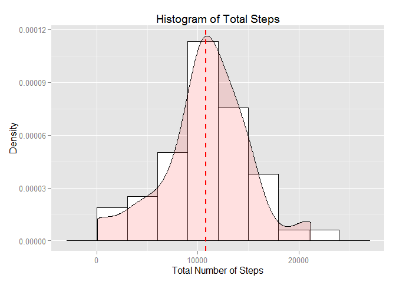
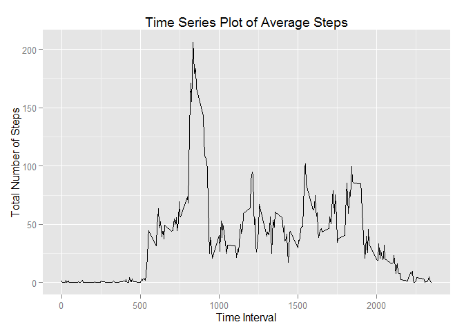
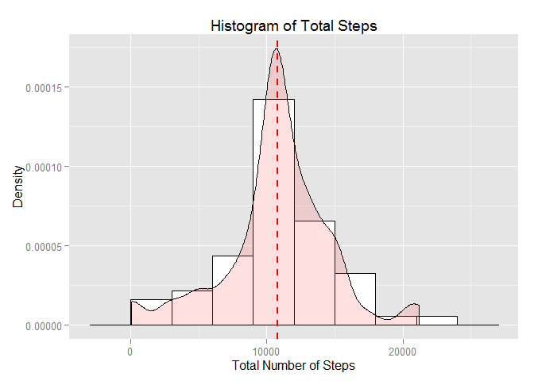
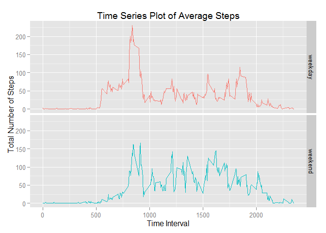

# Reproducible Research: Peer Assessment 1
Jesus Dacuma Jr.  
October 18, 2015  
## Introduction

Wearable technology is the latest trend in fitness; devices such as the Fitbit and Nike Fuelband enables the wearer to constantly track their movement and quantify how "active" their lifestyle is. This report analyzes data from a personal activity monitoring device for behavioral trends. Through some simple summaries of the data, one can make health recommendations based on the analysis.

## Loading and preprocessing the data

The file `activity.csv` consists of two months of data from an anonymous individual collected during the months of October and November 2012. The data includes the number of steps taken in each 5 minute interval of each day. 


```r
# Load the data
library(dplyr)
```

```
## 
## Attaching package: 'dplyr'
## 
## The following objects are masked from 'package:stats':
## 
##     filter, lag
## 
## The following objects are masked from 'package:base':
## 
##     intersect, setdiff, setequal, union
```

```r
activity <- tbl_df(read.csv('activity.csv', colClasses = c('integer', 'factor', 'integer'))) 
str(activity)
```

```
## Classes 'tbl_df', 'tbl' and 'data.frame':	17568 obs. of  3 variables:
##  $ steps   : int  NA NA NA NA NA NA NA NA NA NA ...
##  $ date    : Factor w/ 61 levels "2012-10-01","2012-10-02",..: 1 1 1 1 1 1 1 1 1 1 ...
##  $ interval: int  0 5 10 15 20 25 30 35 40 45 ...
```

```r
activity
```

```
## Source: local data frame [17,568 x 3]
## 
##    steps       date interval
## 1     NA 2012-10-01        0
## 2     NA 2012-10-01        5
## 3     NA 2012-10-01       10
## 4     NA 2012-10-01       15
## 5     NA 2012-10-01       20
## 6     NA 2012-10-01       25
## 7     NA 2012-10-01       30
## 8     NA 2012-10-01       35
## 9     NA 2012-10-01       40
## 10    NA 2012-10-01       45
## ..   ...        ...      ...
```

After loading the data into a data table `activity`, one can immediately see that some missing values exist. The monitoring device was likely OFF during the times where the data is missing. This data will have to be dealt with; for now, it will be omitted in all calculations.

## What is mean total number of steps taken per day?

The data table `daily` groups the activity data (with missing values filtered out) by date and gives the total steps recorded from each day. A histogram of the total steps from each day is shown below. 


```r
# Calculate the total number of steps taken per day
daily <- activity %>% filter(!is.na(steps)) %>% 
    group_by(date) %>% summarize(totalSteps = sum(steps))
daily
```

```
## Source: local data frame [53 x 2]
## 
##          date totalSteps
## 1  2012-10-02        126
## 2  2012-10-03      11352
## 3  2012-10-04      12116
## 4  2012-10-05      13294
## 5  2012-10-06      15420
## 6  2012-10-07      11015
## 7  2012-10-09      12811
## 8  2012-10-10       9900
## 9  2012-10-11      10304
## 10 2012-10-12      17382
## ..        ...        ...
```

```r
# Calculate and report the mean and median of the total number of steps taken per day
daily %>% summarize(mean(totalSteps), median(totalSteps))
```

```
## Source: local data frame [1 x 2]
## 
##   mean(totalSteps) median(totalSteps)
## 1         10766.19              10765
```

```r
# Make a histogram of the total number of steps taken each day
library(ggplot2)
ggplot(daily, aes(x=totalSteps)) + 
    geom_histogram(aes(y=..density..), binwidth=3000, colour="black", fill="white") +
    geom_density(alpha=.2, fill="#FF6666") +
    geom_vline(aes(xintercept=mean(totalSteps)), color="red", linetype="dashed", size=1) + 
    labs(title = "Histogram of Total Steps", x = "Total Number of Steps", y = "Density")
```

 

The distribution of total steps shown in the histogram resembles a normal distribution, with the mean at the center shown as a red dotted line. The owner of the personal monitoring device can use the mean as a benchmark of any improvements in fitness over time.

## What is the average daily activity pattern?

Another useful way to check on activity trends is to monitor it over time. This will indicate when the user is most (or least) active, so the user can find ways to increase activity.


```r
# Make a time series plot of the 5-minute interval (x-axis) and the average number of steps taken, averaged across all days (y-axis)
stepTimes <- activity %>% filter(!is.na(steps)) %>%
    group_by(interval) %>% summarize(avgSteps = mean(steps))
ggplot(data=stepTimes, aes(x=interval, y=avgSteps, group=2)) + geom_line() + 
    labs(title = "Time Series Plot of Average Steps", x = "Time Interval", y = "Total Number of Steps")
```

 

```r
# Which 5-minute interval, on average across all the days in the dataset, contains the maximum number of steps?
stepTimes %>% filter(avgSteps == max(avgSteps)) %>% select(interval)
```

```
## Source: local data frame [1 x 1]
## 
##   interval
## 1      835
```

It seems from the time-series plot that the user is most active between 8:00 and 9:30 AM, with peak activity at around 8:35 AM, probably due to a morning workout. From there, the user is active, to a lesser degree, between the hours of 1:00 and 7:00 PM, before the activity gradually decreases to almost nothing (when the user is sleeping).

## Imputing missing values

Earlier, the missing data was ommited during analysis; however, it may be valuable to impute the data, as ommitting the missing data may create biases that affect the analysis.

To do this, all missing data is replaced with the average number of steps for the missing data's respecitve 5-minute time interval.


```r
# Calculate and report the total number of missing values in the dataset
nrow(filter(activity, is.na(steps)))
```

```
## [1] 2304
```

```r
# Create a new dataset that is equal to the original dataset but with the missing data filled in
imputed <- activity %>% inner_join(stepTimes, by = 'interval') %>%
    mutate(steps = ifelse(is.na(steps), avgSteps, steps), avgSteps = NULL)
imputed
```

```
## Source: local data frame [17,568 x 3]
## 
##        steps       date interval
## 1  1.7169811 2012-10-01        0
## 2  0.3396226 2012-10-01        5
## 3  0.1320755 2012-10-01       10
## 4  0.1509434 2012-10-01       15
## 5  0.0754717 2012-10-01       20
## 6  2.0943396 2012-10-01       25
## 7  0.5283019 2012-10-01       30
## 8  0.8679245 2012-10-01       35
## 9  0.0000000 2012-10-01       40
## 10 1.4716981 2012-10-01       45
## ..       ...        ...      ...
```

```r
# Make a histogram of the total number of steps taken each day 
daily_new <- imputed %>% group_by(date) %>% summarize(totalSteps = sum(steps))
ggplot(daily_new, aes(x=totalSteps)) + 
    geom_histogram(aes(y=..density..), binwidth=3000, colour="black", fill="white") +
    geom_density(alpha=.2, fill="#FF6666") +
    geom_vline(aes(xintercept=mean(totalSteps)), color="red", linetype="dashed", size=1) + 
    labs(title = "Histogram of Total Steps", x = "Total Number of Steps", y = "Density")
```

 

```r
# Calculate and report the mean and median total number of steps taken per day.
daily_new %>% summarize(mean(totalSteps), median(totalSteps))
```

```
## Source: local data frame [1 x 2]
## 
##   mean(totalSteps) median(totalSteps)
## 1         10766.19           10766.19
```

Note that with the missing data filled in, the median number of steps per day is now equal to the mean. Also, adding in the missing data with average steps makes the histogram distribution thinner, or skewed to the center.

## Are there differences in activity patterns between weekdays and weekends?

Because personal routines change drastically between weekdays and weekends, it may be a good idea to analyze the data for differences in weekend and weekday activity.


```r
# Create a new factor variable in the dataset indicating whether a given date is a weekday or weekend day
imputed <- imputed %>%
    mutate(day = as.factor(ifelse(weekdays(as.Date(date)) %in% c('Saturday', 'Sunday'), 'weekend', 'weekday')))
imputed
```

```
## Source: local data frame [17,568 x 4]
## 
##        steps       date interval     day
## 1  1.7169811 2012-10-01        0 weekday
## 2  0.3396226 2012-10-01        5 weekday
## 3  0.1320755 2012-10-01       10 weekday
## 4  0.1509434 2012-10-01       15 weekday
## 5  0.0754717 2012-10-01       20 weekday
## 6  2.0943396 2012-10-01       25 weekday
## 7  0.5283019 2012-10-01       30 weekday
## 8  0.8679245 2012-10-01       35 weekday
## 9  0.0000000 2012-10-01       40 weekday
## 10 1.4716981 2012-10-01       45 weekday
## ..       ...        ...      ...     ...
```

```r
# Make time series plots of the 5-minute interval (x-axis) and the average number of steps taken, averaged across all weekday days or weekend days (y-axis).
stepTimes_new <- imputed %>% group_by(day, interval) %>% summarize(avgSteps = mean(steps))
ggplot(data=stepTimes_new, aes(x=interval, y=avgSteps, color=day)) + geom_line() + 
    facet_grid(day ~ .) + guides(color=FALSE) + 
    labs(title = "Time Series Plot of Average Steps", x = "Time Interval", y = "Total Number of Steps")
```

 

Some expected differences in weekday and weekend activity become apparent when separately plotted (as shown above). The first increase in activity (when the user wakes up) occurs shortly after 5:00 AM on weekdays, while the activity gradually occurs between 6:00 and 7:30 AM. Also, the morning workout peak at 8:35 AM is gone from weekends, although the user is more active throughout the day, and even later at night.

## Conclusion

Wearable technology, such as the personal activity monitor used for this report, can be useful devices for quantifying an individual's lifestyle. For this report, the device monitored user activity in order to find fitness patterns that can be improved upon. Through a simple analysis of the data, one may recommend continuing the morning workout that contributes to the user's peak activity on weekdays, and possibly performing the same activity (or similar) during the weekends.
