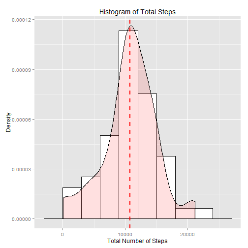
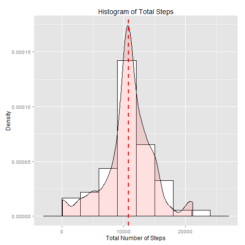

## Loading and preprocessing the data


```r
# Load the data
library(dplyr)
activity <- tbl_df(read.csv('activity.csv', colClasses = c('integer', 'factor', 'integer'))) 
str(activity)
```

```
## Classes 'tbl_df', 'tbl' and 'data.frame':	17568 obs. of  3 variables:
##  $ steps   : int  NA NA NA NA NA NA NA NA NA NA ...
##  $ date    : Factor w/ 61 levels "2012-10-01","2012-10-02",..: 1 1 1 1 1 1 1 1 1 1 ...
##  $ interval: int  0 5 10 15 20 25 30 35 40 45 ...
```

## What is mean total number of steps taken per day?


```r
# Calculate the total number of steps taken per day
daily <- activity %>% filter(!is.na(steps)) %>% 
    group_by(date) %>% summarize(totalSteps = sum(steps))

# Make a histogram of the total number of steps taken each day
library(ggplot2)
ggplot(daily, aes(x=totalSteps)) + 
    geom_histogram(aes(y=..density..), binwidth=3000, colour="black", fill="white") +
    geom_density(alpha=.2, fill="#FF6666") +
    geom_vline(aes(xintercept=mean(totalSteps)), color="red", linetype="dashed", size=1)
```

 

```r
# Calculate and report the mean and median of the total number of steps taken per day
daily %>% summarize(mean(totalSteps), median(totalSteps))
```

```
## Source: local data frame [1 x 2]
## 
##   mean(totalSteps) median(totalSteps)
## 1         10766.19              10765
```


## What is the average daily activity pattern?


```r
# Make a time series plot of the 5-minute interval (x-axis) and the average number of steps taken, averaged across all days (y-axis)
stepTimes <- activity %>% filter(!is.na(steps)) %>%
    group_by(interval) %>% summarize(avgSteps = mean(steps))
ggplot(data=stepTimes, aes(x=interval, y=avgSteps, group=2)) + geom_line() 
```

 

```r
# Which 5-minute interval, on average across all the days in the dataset, contains the maximum number of steps?
stepTimes %>% filter(avgSteps == max(avgSteps)) %>% select(interval)
```

```
## Source: local data frame [1 x 1]
## 
##   interval
## 1      835
```

## Imputing missing values


```r
# Calculate and report the total number of missing values in the dataset
nrow(filter(activity, is.na(steps)))
```

```
## [1] 2304
```

```r
# Create a new dataset that is equal to the original dataset but with the missing data filled in
imputed <- activity %>% inner_join(stepTimes, by = 'interval') %>%
    mutate(steps = ifelse(is.na(steps), avgSteps, steps), avgSteps = NULL)

# Make a histogram of the total number of steps taken each day 
daily_new <- imputed %>% group_by(date) %>% summarize(totalSteps = sum(steps))
ggplot(daily_new, aes(x=totalSteps)) + 
    geom_histogram(aes(y=..density..), binwidth=3000, colour="black", fill="white") +
    geom_density(alpha=.2, fill="#FF6666") +
    geom_vline(aes(xintercept=mean(totalSteps)), color="red", linetype="dashed", size=1)
```

 

```r
# Calculate and report the mean and median total number of steps taken per day.
daily_new %>% summarize(mean(totalSteps), median(totalSteps))
```

```
## Source: local data frame [1 x 2]
## 
##   mean(totalSteps) median(totalSteps)
## 1         10766.19           10766.19
```

```r
# Do these values differ from the estimates from the first part of the assignment? What is the impact of imputing missing data on the estimates of the total daily number of steps?
```

## Are there differences in activity patterns between weekdays and weekends?


```r
# Create a new factor variable in the dataset indicating whether a given date is a weekday or weekend day
imputed <- imputed %>%
    mutate(day = as.factor(ifelse(weekdays(as.Date(date)) %in% c('Saturday', 'Sunday'), 'weekend', 'weekday')))

# Make time series plots of the 5-minute interval (x-axis) and the average number of steps taken, averaged across all weekday days or weekend days (y-axis).
stepTimes_new <- imputed %>% group_by(day, interval) %>% summarize(avgSteps = mean(steps))
ggplot(data=stepTimes_new, aes(x=interval, y=avgSteps, color=day)) + geom_line() + 
    facet_grid(day ~ .) + guides(color=FALSE)
```

 
